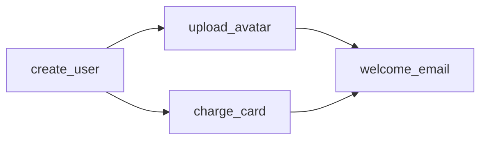

---
{"dg-publish":true,"createdAt":"2024.11.08 금 오후 17:43","modifiedAt":"2025.01.10 금 오후 12:12","tags":["erlang","elixir","data_structure","ets"],"permalink":"/Dev/elixir/erlang 데이터 구조/","dgPassFrontmatter":true}
---


elixir는 erlang의 모든 데이터 구조를 사용할 수 있다.

### queue

FIFO(선입선출)식 데이터 구조. O(N)

```elixir
ex(1) > my_queue = :queue.new()
# {[], []}
iex(2) > my_queue = :queue.in(1, my_queue)
# {[1], []}
iex(3) > my_queue = :queue.in(2, my_queue)
# {[2], [1]}
iex(4) > {{:value, my_value}, my_queue} = :queue.out(my_queue)
# {{:value, 1}, {[], [2]}}
iex(5) > {{:value, my_value}, my_queue} = :queue.out(my_queue)
# {{:value, 2}, {[], []}}
iex(6) > {:empty, my_queue} = :queue.out(my_queue)
# {:empty, {[], []}}
```

### sets

https://www.erlang.org/doc/apps/stdlib/sets.html

유니크한 값 그룹
version:2 는 OTP 24+를 실행하는 경우에만 사용할 수 있으며 더 성능이 좋은 집합 표현이니 무조건 쓴다고 생각하셈.

```elixir
iex(1) > unique_emails = :sets.new(version: 2)
# %{}
iex(2) > unique_emails = :sets.add_element("john@cool-app.com", unique_emails)
# %{"john@cool-app.com" => []}
iex(3) > unique_emails = :sets.add_element("jane@cool-app.com", unique_emails)
# %{"jane@cool-app.com" => [], "john@cool-app.com" => []}
iex(4) > unique_emails = :sets.add_element("jane@cool-app.com", unique_emails)
# %{"jane@cool-app.com" => [], "john@cool-app.com" => []}>)
```

### ordsets

https://www.erlang.org/doc/apps/stdlib/ordsets.html

정렬된 sets.
sets.to_list는 순서를 보장하지 않지만, ordsets.to_list는 순서가 보장됨

```elixir
iex(1) > set = :ordsets.new()
# [] 
iex(2) > set = :ordsets.add_element("Jane Smith", set)
# ["Jane Smith"]
iex(3) > set = :ordsets.add_element("Alex Koutmos", set)
# ["Alex Koutmos", "Jane Smith"]
iex(4) > set = :ordsets.add_element("Alex Koutmos", set)
# ["Alex Koutmos", "Jane Smith"] 
iex(5) > :ordsets.to_list(set)
# ["Alex Koutmos", "Jane Smith"]
```

### gb_sets

https://www.erlang.org/doc/apps/stdlib/gb_sets.html

균형 트리 기반의 sets
다른 sets는 === 비교를 하는 반면, gb_sets는 == 비교를 하기 때문에 42와 42.0를 구분해야 하는 경우 적합하지 않다. 일반적으로는 3~4배 느리지만, 크기가 다른 sets들을 포함하거나, 대규모 세트, 혹은 한 세트를 재귀적으로 테스트 하는 경우는 수십 수백배 빨라질 수 있다.

```elixir
ex(1) > set = :gb_sets.new()
# {0, nil} 
iex(2) > set = :gb_sets.add_element(42, set)
# {1, {42, nil, nil}}
iex(3) > set = :gb_sets.add_element(2, set)
# {2, {42, {2, nil, nil}, nil}}
iex(4) > set = :gb_sets.add_element(10, set)
# {3, {42, {2, nil, {10, nil, nil}}, nil}}
iex(5) > set = :gb_sets.add_element(10, set)
# {3, {42, {2, nil, {10, nil, nil}}, nil}} ②
iex(6) > :gb_sets.to_list(set) ③
# [2, 10, 42]
```

### array

https://www.erlang.org/doc/apps/stdlib/array.html

```elixir
iex(1) > array = :array.new() 
# {:array, 0, 10, :undefined, 10}
iex(2) > array = :array.set(0, "Alex Koutmos", array) ②
# {:array, 1, 10, :undefined,
#		{"Alex Koutmos", :undefined, :undefined, :undefined, :undefined,
#		:undefined, :undefined, :undefined, :undefined, :undefined}
# }
iex(3) > array = :array.set(1, "Bob Smith", array)
# {:array, 2, 10, :undefined,
# 	{"Alex Koutmos", "Bob Smith", :undefined, :undefined, :undefined,
# 	:undefined, :undefined, :undefined, :undefined, :undefined}
# }
ex(4) > array = :array.set(2, "Jannet Angelo", array)
# {:array, 3, 10, :undefined,
# 	{"Alex Koutmos", "Bob Smith", "Jannet Angelo", :undefined, :undefined,
# 	:undefined, :undefined, :undefined, :undefined, :undefined}
# }
iex(5) > :array.get(1, array) ③
"Bob Smith"
iex(6) > :array.get(2, array)
"Jannet Angelo"
```

### timer

https://www.erlang.org/doc/apps/stdlib/timer.html

시간을 측정하는데 유용하다

```elixir
large_dataset = Enum.to_list(1..2_500_000)

{enum_time, enum_result} =
  :timer.tc(fn ->
    large_dataset
    |> Enum.reject(&(rem(&1, 2) == 1))
    |> Enum.map(&(&1 * 2))
    |> Enum.sum()
  end)

{stream_time, stream_result} =
  :timer.tc(fn ->
    large_dataset
    |> Stream.reject(&(rem(&1, 2) == 1))
    |> Stream.map(&(&1 * 2))
    |> Enum.sum()
  end)

IO.inspect(enum_result == stream_result, label: "Equal results")
#   Equal results: true

enum_time
|> System.convert_time_unit(:microsecond, :millisecond)
|> IO.inspect(label: "Enum time (ms)")
# Enum time (ms): 1497

stream_time
|> System.convert_time_unit(:microsecond, :millisecond)
|> IO.inspect(label: "Stream time (ms)")
# Stream time (ms): 1043
```

### use case: binary_to_term, term_to_binary

term이란 elixir, erlang에서 사용하는 데이터 조각이다.
신뢰할 수 있는 다른 어플리케이션등으로 데이터를 전송해야 하는 경우 유용하다.
신뢰할 수 없는 경우에는 꼭 :safe 옵션을 주자.

```elixir
ex(1) > my_data = %{name: "John Smith", age: 42, favorite_lang: :elixir}
# %{age: 42, favorite_lang: :elixir, name: "John Smith"}
iex(2) > base_64_serialized = my_data 
		|> :erlang.term_to_binary() 
		|> Base.encode64()
# "g3QAAAADZAADYWdlYSpkAA1mYXZvcml0ZV9sYW5nZAAGZWxpeGlyZAAEbmFtZW0AAAAKSm9obiBTbWl0aA=="
iex(3) > base_64_serialized |> Base.decode64!() |> :erlang.binary_to_term([:safe])
# %{age: 42, favorite_lang: :elixir, name: "John Smith"}
```

### md5

해시를 빠르게 생성할 수 있으므로 파일의 변경을 추적하는 상황에서 유용하다.

```elixir
iex(1) > "./elixir_patterns.pdf" 
		|> File.read!() 
		|> :erlang.md5()
# <<168, 142, 134, 106, 203, 208, 151, 185, 200, 125, 31, 103, 26, 184, 157, 110>>
```

### phash2

데이터를 분할하거나 프로세스/노드 그룹에 작업을 분산해야 하는 경우 우용하다.
아래 예에서는 term에 대해서 0~9사이의 인덱스에 각각의 작업이 분배된 것이다.
약간의 차이는 있지만 얼추 균등하게 작업이 분배된 것을 볼 수 있다.

```elixir
iex(1) > 1..100_000 |>
...(1) > Enum.reduce(%{}, fn number, acc ->
...(1) > 	index = :erlang.phash2("Some data - #{number}", 10) ①
...(1) > 	Map.update(acc, index, 1, &(&1 + 1))
...(1) > end)
# %{
# 0 => 9961,
# 1 => 10092,
# 2 => 10026,
# 3 => 9929,
# 4 => 10000,
# 5 => 10112,
# 6 => 10121,
# 7 => 9844,
# 8 => 10078,
# 9 => 9837
# }
```

### memory

```elixir
iex(8)> :erlang.memory()
[
  total: 38873548,
  processes: 15389696,
  processes_used: 15389552,
  system: 23483852,
  atom: 442553,
  atom_used: 427725,
  binary: 736448,
  code: 7909922,
  ets: 547960
]
```

### system_info

```elixir
iex(9)> :erlang.system_info(:system_version)
~c"Erlang/OTP 27 [erts-15.0.1] [source] [64-bit] [smp:10:10] [ds:10:10:10] [async-threads:1] [jit]\n"
iex(2) > :erlang.system_info(:atom_count)
14091
iex(3) > :erlang.system_info(:atom_limit)
1048576
iex(4) > :erlang.system_info(:ets_count)
23
iex(5) > :erlang.system_info(:schedulers)
10
iex(6) > :erlang.system_info(:emu_flavor)
:jit
```

### [Digraph](https://www.erlang.org/doc/apps/stdlib/digraph.html)

방향이 있는 그래프로써 Mutable 자료형이다.
상태는 [ETS](https://elixirschool.com/ko/lessons/storage/ets)에 지속된다.
아래와 같은 workflow를 elixir의 Digraph로 만들어보자.



```elixir
# acyclic(비순환) 
iex(1) > my_workflow = :digraph.new([:acyclic]) 
# {
# 	:digraph, 
#		#Reference<0.1888117864.2375680005.579>,
# 	#Reference<0.1888117864.2375680005.580>,
# 	#Reference<0.1888117864.2375680005.581>, 
# 	false
# }

iex(2) > do_work = fn step ->
...(2) > 		fn ->
...(2) > 			IO.puts("Running the following step: " <> step)
...(2) >
...(2) > 			# Simulate load
...(2) > 			Process.sleep(500)
...(2) > 		end
...(2) > end

iex(3) > :digraph.add_vertex(my_workflow, :create_user, do_work.("Create user in database"))
# :create_user
iex(4) > :digraph.add_vertex(my_workflow, :upload_avatar, do_work.("Upload image to S3"))
# :upload_avatar
iex(5) > :digraph.add_vertex(my_workflow, :charge_card, do_work.("Bill credit card"))
# :charge_card
iex(6) > :digraph.add_vertex(my_workflow, :welcome_email, do_work.("Send welcome email"))
# :welcome_email

iex(7) > :digraph.add_edge(my_workflow, :create_user, :upload_avatar) ②
# [:"$e" | 0]
iex(8) > :digraph.add_edge(my_workflow, :create_user, :charge_card)
# [:"$e" | 1]
iex(9) > :digraph.add_edge(my_workflow, :upload_avatar, :welcome_email)
# [:"$e" | 2]
iex(10) > :digraph.add_edge(my_workflow, :charge_card, :welcome_email)
# [:"$e" | 3]

ex(11) > :digraph.info(my_workflow) ①
# [cyclicity: :acyclic, memory: 1779, protection: :protected]
iex(12) > :digraph.source_vertices(my_workflow) ②
# [:create_user]
iex(13) > :digraph.sink_vertices(my_workflow) ③
# [:welcome_email]
iex(14) > :digraph_utils.is_acyclic(my_workflow) ④
# true
iex(15) > my_workflow 
...(15) > 	|> :digraph_utils.topsort()
...(15) > 	|> Enum.each(fn vertex -> 
...(15) >				{_vertex, work_function} = :digraph.vertex(my_workflow, vertex)
...(15) > 			work_function.()
...(15) > 	end)


Running the following step: Create user in database
Running the following step: Bill credit card
Running the following step: Upload image to S3
Running the following step: Send welcome email
# :ok
iex(16) > :digraph.delete(my_workflow) ⑥
# true
```

add_vertex:  정점을 생성
add_edge: 방향을 긋는다.
info:  얼마나 많은 메모리를 소비하는지와 세부 사항을 확인할 수 있다.
source_vertices: enter 정점 나열
sink_vertices: exit 정점 나열
is_acyclic: 순환적이지 않은지 확인
delete: ets 테이블을 삭제하고 정리
digraph_utils.topsort: 그래프를 위상 정렬. 부모 정점이 자식 정점보다 먼저 방문하도록 하여 모든 종속성을 평가할 수 있도록 한다.

### :atomics, :counters module

이들은 가변 데이터이며 데이터 구조라기보단 그 이상의 것이다.
목적 기반 저장 메커니즘이며 고도로 최적화하는 사용 사례가 필요할때를 위해 존재한다.
특히 :atomics, :counters 모듈은 가능한 성능이 좋은 방식으로 숫자 배열에 더하고 빼는 작업을 하기 위해 특별히 설계된 하드웨어 가속 모듈이다.
차이는 :atomics는 많은 변경이 일어나더라도 데이터 불일치가 발생하지 않고
:counters는 읽기 불일치를 대가로 추가적인 성능을 얻을 수 있다.z

### 저장소 모듈

:ets - 메모리 기반 저장소
:dets - 디스크 기반 저장소, ets와 1:1 호환 가능함

### 암호화 모듈

:crypto.hash, :crypto.mac,
